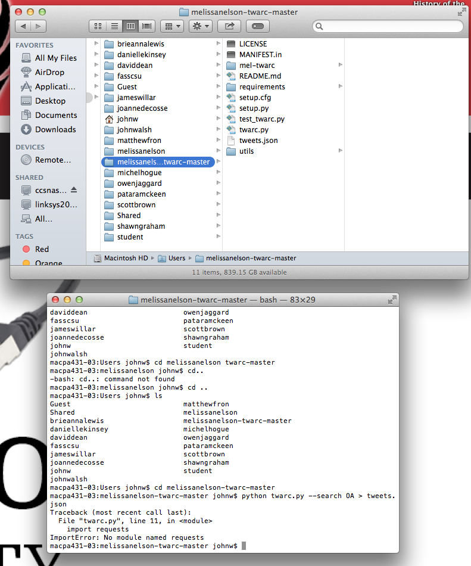

###Collecting Data from Twitter

My twarc results for searches [OA](https://github.com/1991MelJ/Open-Notebook-/blob/master/Final%20Project/mel-oa.csv), [open access](https://github.com/1991MelJ/Open-Notebook-/blob/master/Final%20Project/mel-openaccess.csv) and [SSHRC](https://github.com/1991MelJ/Open-Notebook-/blob/master/Final%20Project/mel-sshrc.csv) were found with the help of Dr. Graham, the computer I am using at Carleton was not allowing me to run the twarc commands so Dr. Graham was kind enough to run them for me and then send me the results. Pip is successfully installed but for some reason, even when I used the main user login the twarc command was unsuccessful:
 

Dr. Graham recommended I read [this article](https://github.com/1991MelJ/ELXN42-Article/blob/master/elxn42.md) by Nick Ruest and Ian Milligan, which uses twitter to collect a data set for understanding how people were talking about the 42nd Canadian Federal Election. This article has a lot of helpful information that is very relevant to my project, such as how they approached collecting and visualizing data. Also look at the resources under Dr. Graham's "Open Access Research" [Repository](https://github.com/1991MelJ/hist3907o/blob/master/workbook/docs/Open-Access-Research/Open-Access-Research.md).

Moving forward I will use Voyant and RizoViz to find word patterns and connections, and try to filter my searches to focus on open access in relation to history. I will also use geoJSON to chart geographical information and understand how Canadians specifically are talking about open access. 

