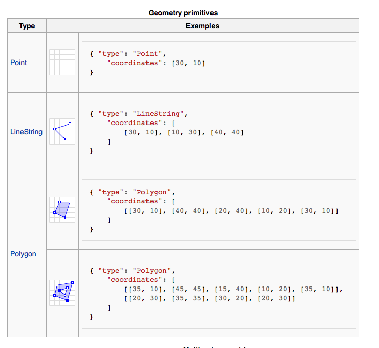
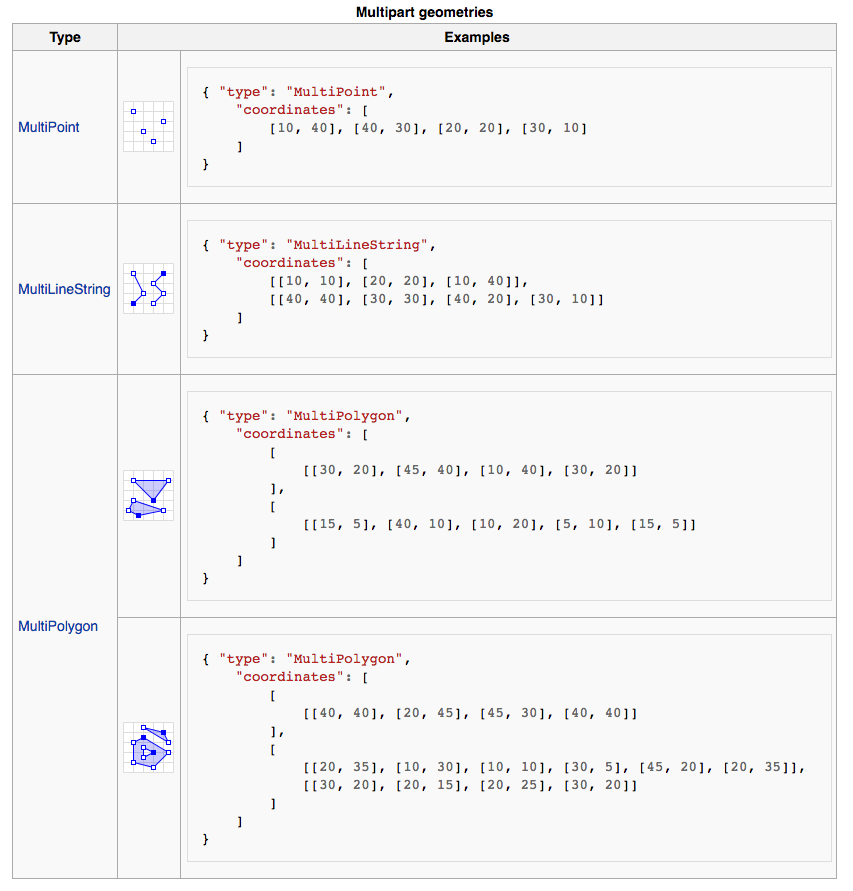

###Mapping with geoJSON

[geoJSON](http://geojson.org/) is a data format for representing geographic data structures. The features include *points* (addresses and locations), *line strings* (streets, highways and boundaries), *polygons* (countries, provinces, tracts of land), and multi-part collections of these types. GeoJSON is supported by numerous mapping software packages ex [Leaflet](http://leafletjs.com/examples/geojson.html) and [GeoServer.](http://geoserver.org/) Also Google, Bing and Yahoo support geoJSON in their API services. [GitHub Help](https://help.github.com/articles/mapping-geojson-files-on-github/) has some tips on how to render geoJSON map files within GitHub repositories, and also provides a template for embedding geoJSON maps outside of GitHub (on any HTML page that supports javascript). 

[This site](http://geojsonlint.com/) gives you a live preview of how geoJSON data appears on a map. Also, for tips on how to use geoJSON read this [article.](http://www.macwright.org/2015/03/23/geojson-second-bite.html)

###Using TWARC

[TWARC](https://github.com/1991MelJ/twarc) can be used to extract the coordinates from tweets, and then turn them into geoJSON data to visualize it into a map. I will use TWARC to gather a dataset from twitter, and using the coordinates from tweets, I will map how and where people are talking about Open Access in relation to history and scholarly publishing. Because scholars, institutions, and students use twitter to share information and express their views I think twitter will become my main source of data for my final project. Previously, I was considering looking through "open" digital libraries to see how open publishing has evolved, and how the open access movement has been discussed within publishing. I will not be doing this, because I do not have the time to go through the amount of published articles/books and "open" digital libraries I would need to get a clear understanding of the evolution of the open access movement.