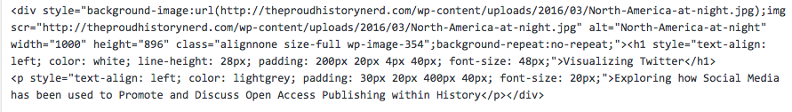
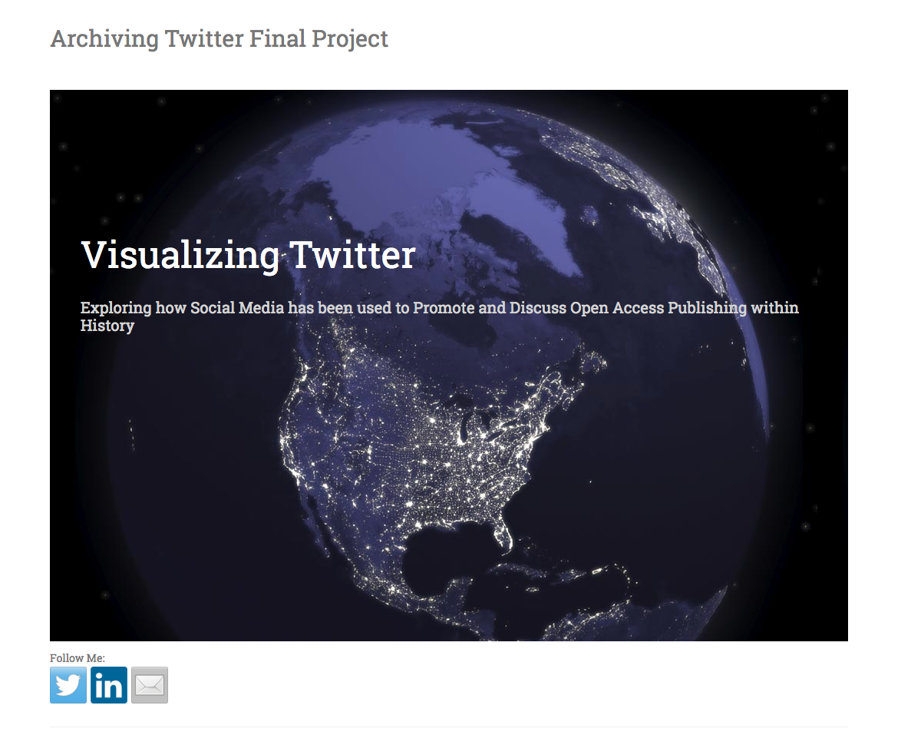

###Using HTML for Text Overlay on Image 

I finally figured out a code that can overlay text on an image, I was struggling with this because my image was appearing cropped and distorted. [This WordPress support forum](https://wordpress.org/support/topic/placing-text-over-an-image) was very helpful here I found the basis for the code I used. I also found [this article](https://mcbuzz.wordpress.com/2008/10/14/how-to-put-text-on-top-of-image-wordpress/) by Mark McLaren very helpful. After making adjustments to the code, I realized that one of the "padding" measurements was causing my image to appear cropped. Here is the code I used:

And success, here is the result, this is a tentative title for my final project:

