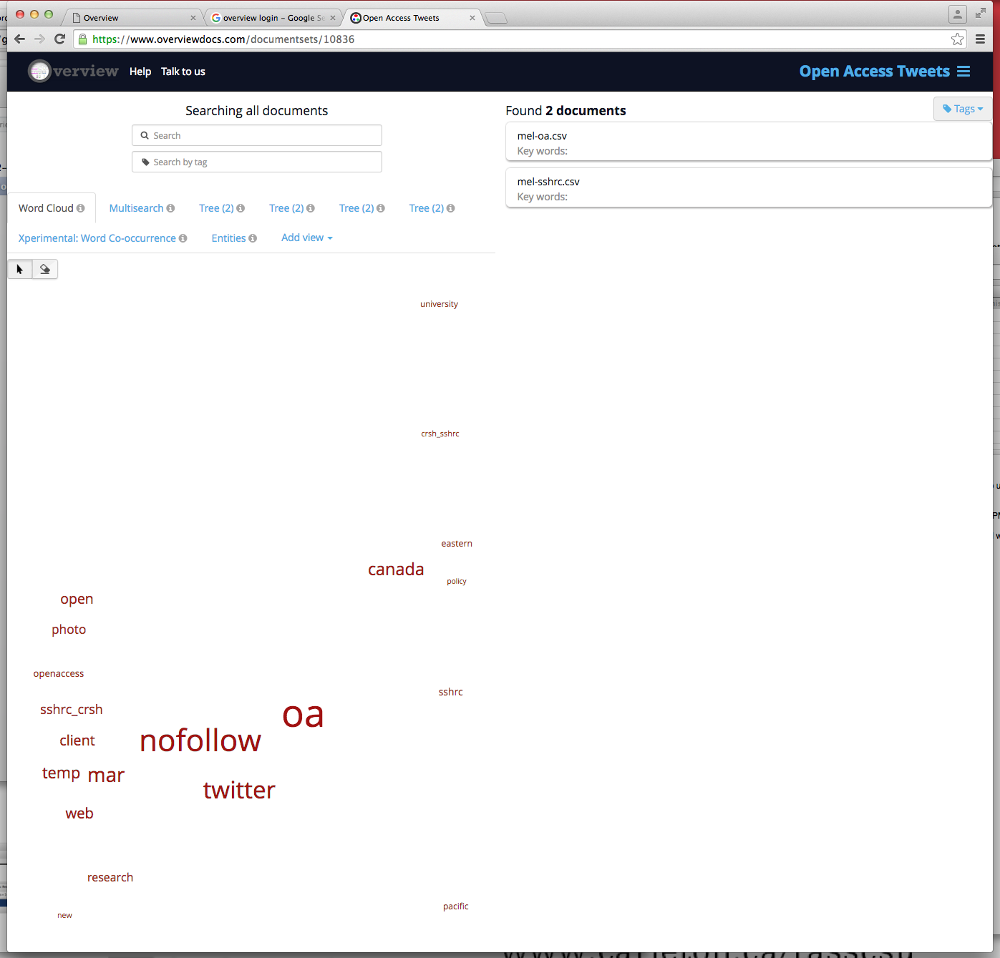

###Problems Visualizing with Overview

For some reason this tool was giving me difficulty as well today. When I first attempted to upload my documents into Overview, I created the `Open Access Tweets` document set and my biggest file, mel-openaccess.csv failed to upload several times.

So I tried again and decided to upload only the mel-openaccessl.csv file to see if it would work. It did, so I added my other two files to this document set. I noticed that my files uploaded differently here from the first document set, I am sure I uploaded the files in each set under "each file is one document". But the second document set `mel-openaccess.csv` looks like this:

I also cannot see some of the data in both document sets, and the stop word feature is not being applied to all of the visualization tools. I'm not sure if it is the format of my files but both Voyant and Overview were giving me issues with this data set. Here is a list of relevant terms, which were found in Overview:

