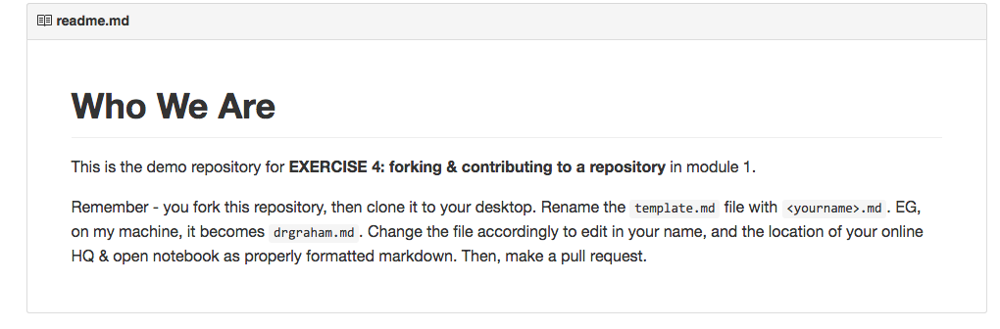

I found this pretty easy, I think Github is getting easier for me to use, it makes more sense to me now. This exercise was good practice for writing with Markdown/in Github. I found a [cute Adventure Time GIF to use in my who-we-are repository](https://github.com/1991MelJ/who-we-are/blob/master/melissanelson.md), I wonder if there is a way to post GIFs and videos to stream directly on your Github page. Side note: Github has some useful tips on writing in Markdown here: https://help.github.com/articles/markdown-basics/ 

