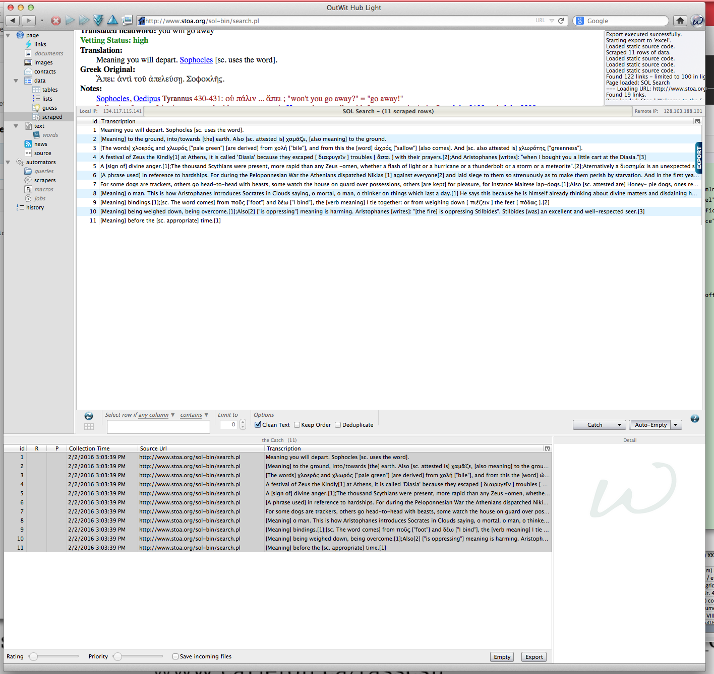

I'm not sure if I did this exercise correctly, the exported excel spreadsheet file that I saved to [my Module 2 github file](https://github.com/1991MelJ/Open-Notebook-/blob/master/module%202/OutWit%20catch%20export%20-%20Stoa_Search.xls/ "Outwit Catch") does not read the same way as it does on Outwit. This is how it reads on Outwit:

I'm sure this tool will be very useful when searching for specific information in the future, but with this example I find it hard to see how relevant the information Outwit provided me with is.