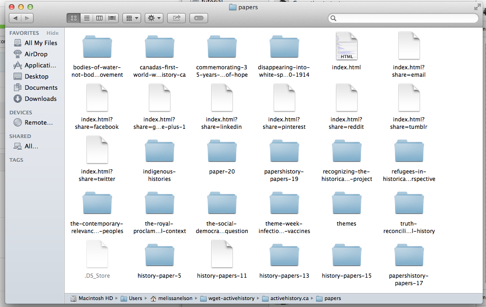

###Wget is a Tool for Downloading Internet Sources

This [Programming Historian Exercise](http://programminghistorian.org/lessons/automated-downloading-with-wget) was to get a sense of how to use wget to download a specific set of files, and to download internet sources by creating a mirror of an entire website. For this exercise I decided to complete the section: "Step Two: Learning about the Structure of Wget – Downloading a Specific Set of Files." In this exercise I used wget to download the papers located in the [active history website under the "features" tab](http://activehistory.ca/papers/). I was introduced to a series of useful commands for wget:

* `-r` means that the wget program should follow the links from the website and download them too ex: while scrapping data from active history wget will follow any links on its page including links to an external website and download data from there as well

* `--no parent` or `-np` means wget should follow the links on active history but not go beyond the parent directory ex: only download data from links that are part of active history domain

* `-l 2` command is used to tell wget to follow a specific link and one page beyond the initial page provided 

* `w 10` adds a 10 sec wait between server requests, also `--random`wait` command for websites whose terms of service do not mention a policy on automated downloading, and may have steps to prohibit automated downloading built into website. This command will vary the wait time.

* `--limit-rate=20k` command limits the bandwidth you will use in download, so that you do not use up too much of server's bandwidth, sets max download speed to 20kb/s

`wget[command][http://URL/]` this is the general command structure for wget. where the `/` symbol must be added to the end of a URL to tell wget that it is finding a directory and NOT a file. So these commands were combined to tell wget: 

`wget -r --no-parent -w 2 --limit-rate=20k http://activehistory.ca/papers/ `

And success! The files were downloaded and I now have a wget-activehistory folder on my server 

 
 
###Use Wget to Mirror an Entire Website

If I want to try the mirror command for wget in the future I must use `-m` to tell wget to download an entire site. An example of a full mirror command would be `wget -m -w 2 --limit-rate=20k http://activehistory.ca/ ` 

###Note

If data is arranged in a directory wget is very useful for retrieving data or for mirroring an entire website. 