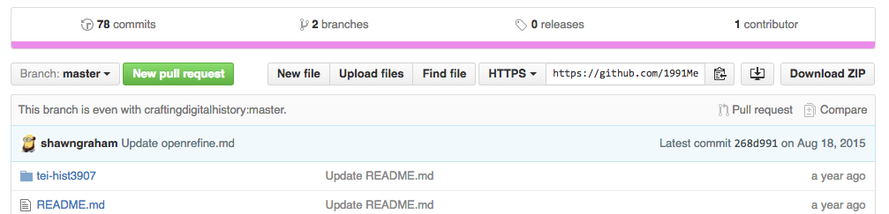

###Data Is Messy: Some Terms to Remember

* `Object Character Recognition` or [OCR](http://electricarchaeology.ca/2014/07/15/doing-ocr-within-r/) is used to identify and recognize patters in digital data that make up letters, numbers, punctuations 
* `Crowdsourcing` a manual way to achieve the same results OCR does, which is organize data and recognize patterns. This is when the information collected by a "crowd" or group of people are brought together to provide information for a project. Also can be collecting and organizing sources, then displaying data in an online database ex: Wikipedia crowdsources for its posts 
* `Mark Up Text` means using "hooks" and "signs" to specify what the text is talking about ex: London, Ontario rather than London, UK
* `Text Encoding Initiative (TEI)` is used to mark up text, this is a standard for representing text in digital form. Encoding methods for machine readable text. [TEI](http://www.tei-c.org/index.xml) is widely used by libraries, museums, publishers, and individual researchers to present text online for online research, teaching, preservation 
* `Big Data` represents a collection of data that is larger that what a single researcher could read ex: the entire Hudson Bay Company records for trading goods prior to 1870
* `Scrapping Data` means grabbing existing "big" historical data  ex: using wget, APIs, or Outwit Hub to find and download data from the web
* `Data Mining` now that you have the data that was scrapped, you use other tools to look through the large quantity of information and "mine" it for the specific information you want. Tools to analyze data and refine the results ex: word clouds, mapping texts, visualization tools, [topic modelling](http://humanities.uva.nl/~mkoolen1/materials/KB_Mallet_2015/KB_Mallet.html#0) 
* `Dataset`set of data that is collected from one source ex: canadiana Canadian History website

###Also Important to Remember 

For this exercise I had to [download a specific repository](https://github.com/1991MelJ/Open-Notebook-/tree/master/module%203/module3-wranglingdata-master) as a zip file and unzip it to a location on my computer. When I began I was sure I remembered how to do this, as I have done it before, but sadly I could not remember and I realized I never wrote any notes to remind myself how to do this. After some searching I remembered. I am leaving an image here so that I can always remember where to look on the repository for the option to download as zip file. 

I will also leave an image to remind myself how to change the settings on nvALT when adding a new folder, just in case I do forget in the future. 

###Remarks on Recovered History

The link for the pamphlet ["Negro Slavery" by Zachary Macaulay](http://www.recoveredhistories.org/pamphlet1.php?page=1&orderby=date&catid=805) was hard to find on the [Recovered Histories website](http://www.recoveredhistories.org) by using the 'browse' function, and was equally difficult through using the 'search' function. I ended up searching for the pamphlet in google and found the date it was published and finally found the text by ordering the documents on the Recovered Histories website by date. When it came to vetting the website, my first impression was that this website was probably written by a history enthusiast and not a scholarly researcher because the format of the website did not look like it belonged to a legitimate organization or scholarly individual. Its hard to say whether or not the information on this website is credible just by looking at it. 

##Transcribing My Page

For this exercise I decided to transcribe page 3 of "Negro Slavery". After completing my transcription, I reached the section for encoding text

I am not sure how to highlight or colour text on Atom, I tried searching the help section of Atom and found nothing helpful. I decided not to complete the encoding section of this exercise and move on to the next one due to lack of time.