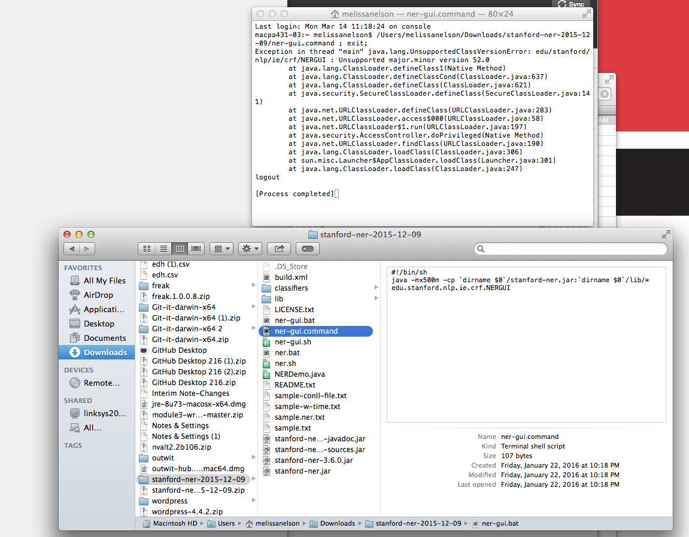
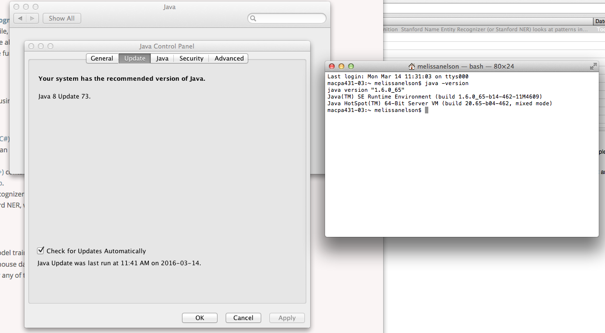
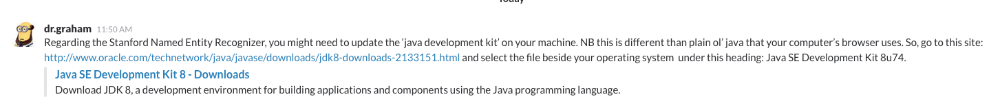
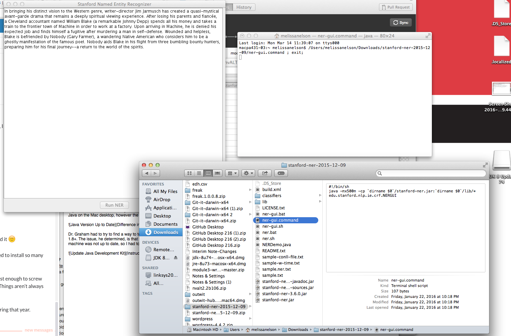
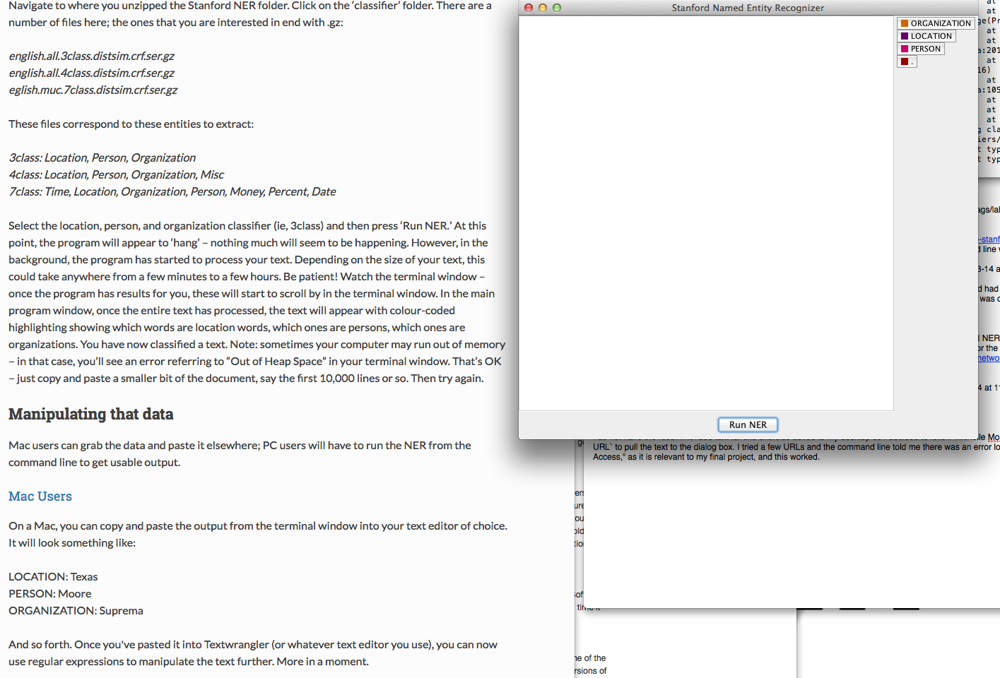
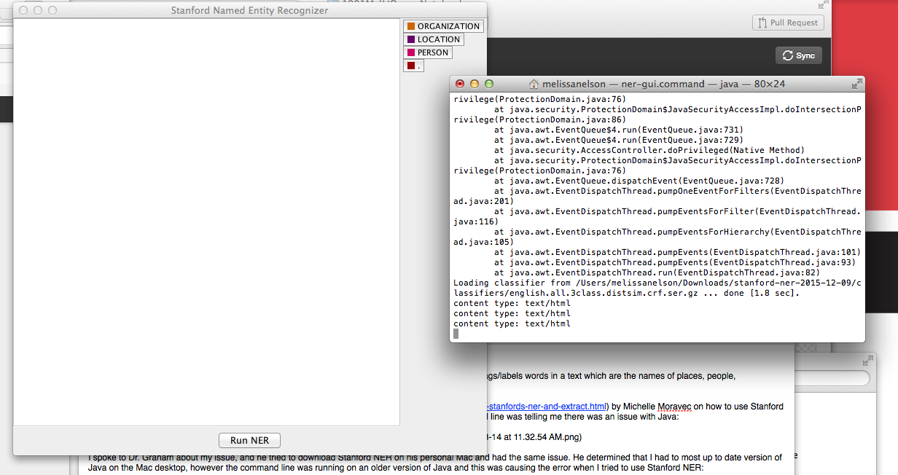
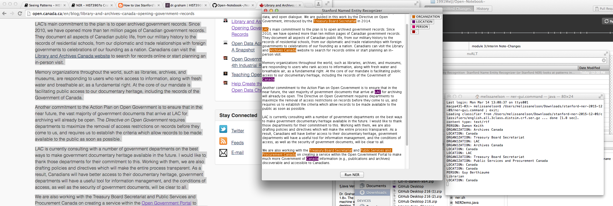

###Name Entity Recognition

Stanford Name Entity Recognizer (or Stanford NER) looks at patterns in metadata, and identifies and tags/labels words in a text which are the names of places, people, organizations, time, date, etc. The results can be extracted and visualized.

Dr. Graham recommended a very useful [tutorial](http://historyinthecity.blogspot.ca/2014/06/how-to-use-stanfords-ner-and-extract.html) by Michelle Moravec on how to use Stanford NER and then extract results on a Mac. The tutorial also shows you how to organize the results into a categorized list ex: list by Location. At first I had an issue with running Stanford NER, the command line was telling me there was an issue with Java: 

I spoke to Dr. Graham about my issue, and he tried to download Stanford NER on his personal Mac and had the same issue. He determined that I had to most up to date version of Java on the Mac desktop, however the command line was running on an older version of Java and this was causing the error when I tried to use Stanford NER:

Dr. Graham had to try to find a way to tell the command line to use to right version of Java, as [Stanford NER](http://nlp.stanford.edu/software/CRF-NER.shtml) requires Java v 1.8+. The issue, he determined, is that there are two components to Java: Java for browser and Java for the machine. While Java for browser was up to date, the Java for my machine was not up to date, so I had to update the [Java Development Kit](http://www.oracle.com/technetwork/java/javase/downloads/jdk8-downloads-2133151.html) on the Mac desktop. The instructions for how to do so are below:

And Success Stanford NER is now running properly!

I do not have the recommended text for this exercise saved to my desktop so I decided to follow Michelle Moravec's instructions on how to import text by selecting `File` and `Load URL` to pull the text to the dialog box. I tried a few URLs and the command line told me there was an error loading those pages, finally I tried to load a Wikipedia page on "Open Access," as it is relevant to my final project, and this worked. I located the `Classifier` folder and selected "3class" which is a location, person, and organization classifier. Keep in mind this process can take anywhere from a few minutes to a few hours depending on the size of the text I enter into Stanford NER.

I tried Running NER for the Wikipedia page, the command line said "done" and "completed" yet I did not see the text appear in Stanford NER with colour coding. I decided to try a different page using its URL and the same issue occurred, Finally, I decided to copy and paste the text from the [Government of Canada website](http://open.canada.ca/en/blog/library-and-archives-canada-opening-government-records) to the Stanford NER dialog box and clicked `Run NER` and the text appeared with colour coding in the dialog box. I think this tool would be useful for my final project, I can use it to see how people talk about open publishing. For bigger text however, I cannot copy and paste so I will have to find a way to get the URL option to work or download the files.

