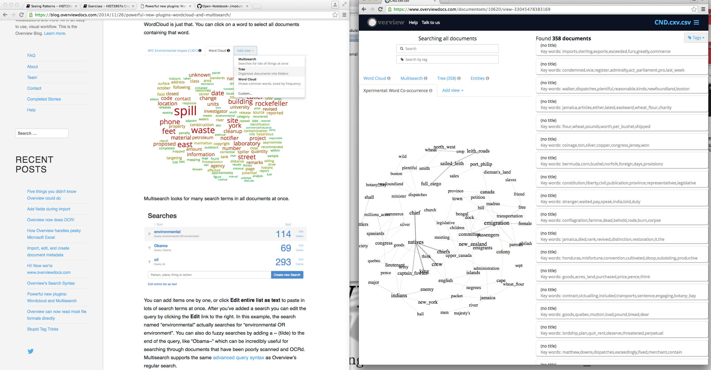
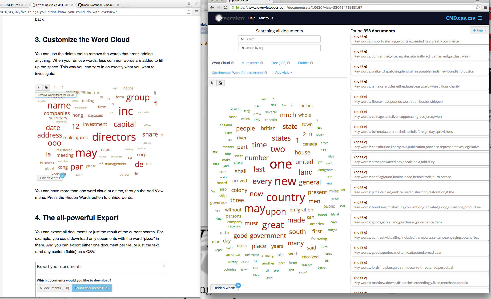

###Seeing Patterns

Why Visualize Data? It can be very useful for seeing holes in research, and also for analyzing data further to understand how dataset is interconnected. This [article by S. Graham, I. Milligan and S. Weingart explains the role of visualization in research](http://www.themacroscope.org/?page_id=469). There are many different tools to approach visualizing data, here I will be using [Overview](https://blog.overviewdocs.com/). This tool looks for word frequencies and their distributions within a document, or a collection of documents, to organize the documents into folders of progressively similar word use. You can download Overview, but for this exercise Dr. Graham suggested using the hosted version, [creating an account and logging in](https://www.overviewdocs.com/). I find this tool very simple and straight forward to use, I like how there are different ways to visualize the text, especially the `Xperimental: Word Co-occurrence` option which shows you which words were used together in a document text. I would like to use this feature for my final project so I can see how scholars are talking about open access in relation to humanities, books, research, Canada, ect. 

