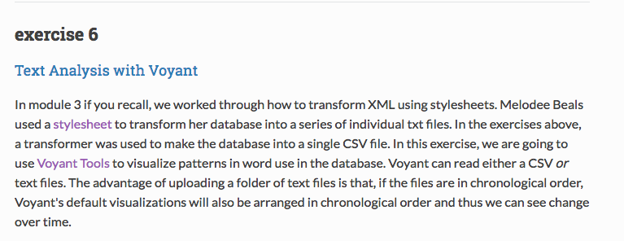
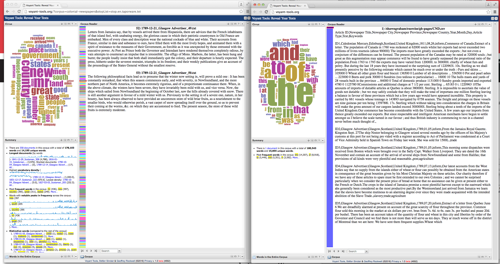

###Using Voyant

I like how Voyant visualizes the text in several ways so you can compare the frequency of the words in more than one way from one page. I do find, however, that Overview was simpler to use and Voyant takes more time to understand all of the features. As part of the exercise, I tried the [RezoViz](http://docs.voyant-tools.org/tools/rezoviz/) tool for the URL that was provided but the system generated an error. So I decided to try a URL of my choice, I used a Government of Canada article ["Canada's Action Plan on Open Government 2014-16."](http://open.canada.ca/en/content/canadas-action-plan-open-government-2014-16) The results were interesting, I did notice however that there were some terms missing that I would have expected to see visualized, such as "Open Government," "access to data," or "open data."

I also tried the [Stopword Tool](http://docs.voyant-tools.org/ui/stopwords/) which is used to tell Voyant to ignore words with less meaning such as in, from, to, etc. There is a pre-existing stop word list, you can add to this list, also remember to select the options icon, then select `Taporware (English)` for the Stopword tool to be applied. I tired this with the URL for `/shawngraham/exercise/gh-pages/CND.csv` and the results are very clear. Voyant removed the words to, and, in, etc. to display the frequency of words with more relevance: 

