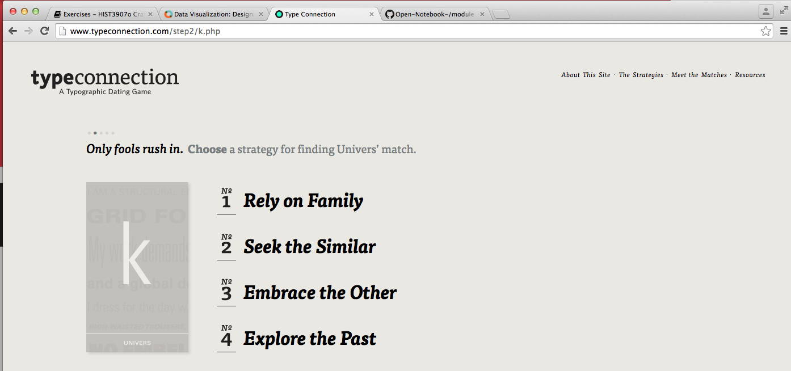
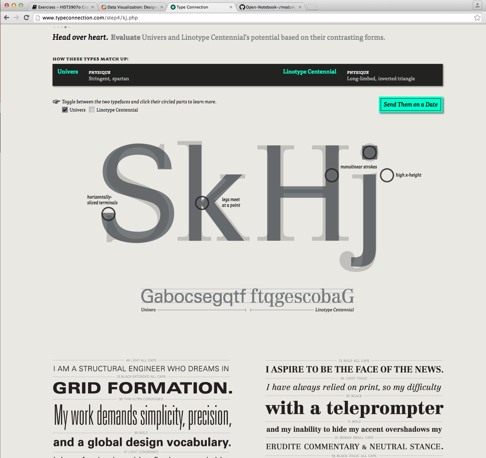
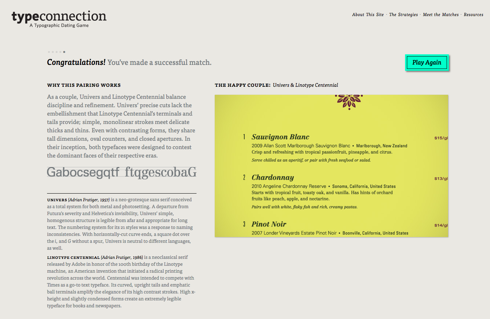
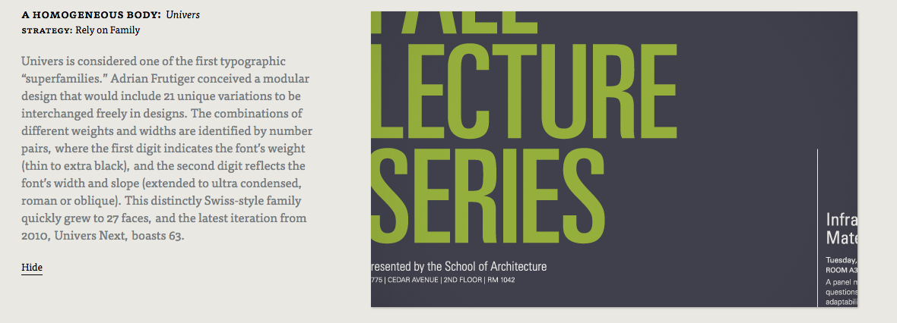

###Does Font Type Matter?

This exercise is to help me understand the importance text font plays in visual communication. Text, as well as the appearance of its words, both convey a message to the reader. Text font creates a mood and atmosphere, and gives the reader clues about how to understand the text. Fonts like `Roman` communicate strength, authority, and legitimacy in its bold and strong appearance. With that in mind, a font like this would not be used by a writer who is trying to convey lighthearted humour in their text. Understanding the role text font plays in visual communication helps the writer choose effective text styles for their documents and projects. 

As part of this exercise I played a few rounds of [Typeconnection](http://www.typeconnection.com/index.php) to find a "dating match" for a font of my choosing. It was a fun and interesting way to understand why various font pairings work, and why some also do not.

And I got a few successful matches, the one shown above was a "happy couple":

###Paradata: What Does My Font Say

I like this font, for my Paradata I would like to choose a font similar to this one because I think it conveys simplicity, maturity, structure, organization. I want to display my progress in this course with clear and concise posts, with visuals to give the reader a better understanding of what I was trying to accomplish in each exercise and what I did successfully in each exercise. Along with font, I think that [colour](http://www.ucreative.com/resources/infographic-a-color-guide-for-designers/) also plays a large role in visual communication, I would prefer to use a white background and minimize the amount of colour I put in my text because I think strong colour in the text would not communicate the level of maturity that I am looking to demonstrate. 

###Create gh-page

the Link to my page can be found [here](http://1991melj.github.io/Open-Notebook-/module%205/myfontchoice.html) I selected two google fonts and followed the instructions to create a gh-page. The HTML codes and "try it yourself" examples on [w3school webpage](http://www.w3schools.com/tags/default.asp) were very helpful for this exercise. I attempted to add my images on here using the `` code but it did not work, it could be because my images are png but I think it may also be because of the size of my images as well. If I can find a way to embed images in html I can use this method to submit my exhibit for my progress in this course. 

The html code for my gh-page can be found under the gh-pages branch of my module 5 file, or [here](https://github.com/1991MelJ/Open-Notebook-/blob/gh-pages/module%205/myfontchoice.html)